# ENDDEIE 2023 — Analisis Estructural de la Digitalizacion Escolar en Chile

## Informe Tecnico de Resultados

---

## 1. Resumen Ejecutivo

Este proyecto construye un pipeline analitico completo sobre la **Encuesta Nacional sobre Disponibilidad y Uso de Tecnologias de Informacion y Comunicacion en la Educacion (ENDDEIE 2023)**, aplicada a establecimientos educacionales publicos de Chile.

El objetivo central es **identificar problematicas estructurales ("dolores") del sistema educativo** relacionadas con la digitalizacion escolar, interpretando los datos no como cifras aisladas, sino como evidencia de desalineaciones sistemicas entre capacidades, gestion y apropiacion pedagogica.

### Hallazgo central

> Las principales problematicas de la digitalizacion educativa en Chile no responden a deficits aislados, sino a **desalineaciones estructurales** entre capacidades, gestion y apropiacion pedagogica, que afectan de forma diferenciada a distintos tipos de establecimientos y territorios.

### Resultados cuantitativos del pipeline

| Metrica | Valor |
|---------|-------|
| Establecimientos analizados | 1.174 |
| Docentes incorporados | 3.736 |
| Estudiantes incorporados | 10.326 |
| Factores estructurales construidos | 5 |
| Brechas detectadas | 25 (5 significativas) |
| Tipologias de establecimientos | 3 |
| Problematicas estructurales identificadas | 5 |
| Perfiles de necesidad de software (ML) | 3 |
| Drivers de adopcion digital (ML) | 12 |
| Barreras de adopcion digital (ML) | 3 |
| Tablas CSV generadas | 23 |
| Figuras PNG generadas | 23 |
| Reportes textuales | 1 |

---

## 2. Datos Fuente

La ENDDEIE 2023 recopila informacion de multiples actores del sistema educativo publico. Se utilizaron 7 archivos CSV:

| Dataset | Archivo | Filas | Columnas | IDs unicos | % Nulos |
|---------|---------|------:|--------:|-----------:|--------:|
| Estudiantes | `ESTUDIANTES_PUBLICA_2023.csv` | 10.326 | 143 | 10.326 | 5,74% |
| Docentes | `DOCENTES_PUBLICA_2023.csv` | 3.736 | 193 | 3.736 | 8,18% |
| Directores (consolidado) | `DIRECTORES_URBANOS_Y_RURALES_PUBLICA_2023.csv` | 1.174 | 162 | 1.174 | 5,55% |
| Directores urbanos | `DIRECTORES_URBANOS_PUBLICA_2023.csv` | 942 | 149 | 942 | 1,51% |
| Directores rurales | `DIRECTORES_RURALES_PUBLICA_2023.csv` | 232 | 260 | 232 | 2,19% |
| Coordinadores | `COORDINADORES_PUBLICA_2023.csv` | 928 | 167 | 928 | 23,35% |
| Pauta (infraestructura) | `PAUTA_PUBLICA_2023.csv` | 1.199 | 33 | 1.199 | 0,43% |

> **Nota:** El dataset de coordinadores presenta un 23,35% de nulidad, lo cual se maneja mediante exclusion caso a caso en los analisis. El dataset de directores rurales carece de la columna `ESTRATO_ANALITICO`.

**Tabla de salida:** `outputs/tables/validacion_estructura_datos.csv`

---

## 3. Arquitectura del Pipeline

El proyecto sigue una arquitectura modular de 7 pasos secuenciales, orquestados desde `main.py`:

```
main.py (orquestador)
  │
  ├─ PASO 1 ─ src/ingestion/load_data.py         → Carga y validacion
  ├─ PASO 2 ─ src/indicators/map_indicators.py    → Mapeo de indicadores
  ├─ PASO 3 ─ src/factors/build_factors.py        → Scores estructurales
  ├─ PASO 4 ─ src/gaps/structural_gaps.py         → Brechas estructurales
  ├─ PASO 5 ─ src/clustering/segment_schools.py   → Segmentacion (KMeans)
  ├─ PASO 6 ─ src/correlations/bottlenecks.py     → Correlaciones Spearman
  ├─ PASO 7 ─ src/synthesis/structural_pain_points.py → Sintesis de dolores
  │
  └─ ETAPA ML — Oportunidades de Software Educativo
     ├─ PASO 8  ─ src/ml/dimensionality/latent_axes.py        → Ejes latentes (PCA + UMAP)
     ├─ PASO 9  ─ src/ml/clustering/software_needs_profiles.py → Perfiles de necesidad de SW
     ├─ PASO 10 ─ src/ml/explainability/drivers_and_barriers.py → Drivers y barreras
     └─ PASO 11 ─ src/ml/evaluation/stability_checks.py        → Estabilidad (bootstrap)
```

### Estructura de directorios

```
ENDDEIE/
├── main.py
├── README.md
├── data/
│   ├── ESTUDIANTES_PUBLICA_2023.csv
│   ├── DOCENTES_PUBLICA_2023.csv
│   ├── DIRECTORES_URBANOS_Y_RURALES_PUBLICA_2023.csv
│   ├── DIRECTORES_URBANOS_PUBLICA_2023.csv
│   ├── DIRECTORES_RURALES_PUBLICA_2023.csv
│   ├── COORDINADORES_PUBLICA_2023.csv
│   └── PAUTA_PUBLICA_2023.csv
├── src/
│   ├── config/settings.py
│   ├── ingestion/load_data.py
│   ├── indicators/map_indicators.py
│   ├── factors/build_factors.py
│   ├── gaps/structural_gaps.py
│   ├── clustering/segment_schools.py
│   ├── correlations/bottlenecks.py
│   ├── synthesis/structural_pain_points.py
│   └── ml/
│       ├── dimensionality/latent_axes.py
│       ├── clustering/software_needs_profiles.py
│       ├── explainability/drivers_and_barriers.py
│       └── evaluation/stability_checks.py
└── outputs/
    ├── tables/    (23 archivos CSV)
    ├── figures/   (23 archivos PNG)
    └── reports/   (1 reporte textual)
```

---

## 4. Marco Analitico: Factores Estructurales

El analisis organiza los 68 indicadores de la ENDDEIE 2023 (distribuidos entre 4 actores y la pauta de infraestructura) en **5 factores estructurales**. Esta organizacion permite superar el analisis variable-por-variable y revelar patrones sistemicos:

| Factor Estructural | Descripcion | Dimensiones Compuestas de la ENDDEIE |
|---|---|---|
| **Gestion y Liderazgo** | Capacidad directiva e institucional para impulsar la innovacion digital | Liderazgo Escolar para la Innovacion, Practicas y Procesos para Innovar, Marco Institucional |
| **Cultura de Innovacion** | Mentalidad, actitudes y promotores del cambio digital | Mentalidad frente a la Innovacion, Promotores y Barreras para Innovar, Actitudes |
| **Apropiacion Pedagogica** | Uso efectivo y con sentido de tecnologia en el proceso de ensenanza-aprendizaje | Innovacion en el Proceso Ensenanza y Aprendizaje, Actividades, Apoyo al Uso |
| **Capacidades Digitales** | Habilidades tecnologicas efectivas y sus efectos percibidos | Habilidades, Efectos |
| **Infraestructura y Acceso** | Disponibilidad de recursos y conectividad tecnologica | Acceso (escala inversa) |

### Distribucion de indicadores por actor

| Actor | Cantidad de indicadores |
|-------|------------------------:|
| Docente | 23 |
| Estudiante | 15 |
| Director | 15 |
| Establecimiento (dimensiones compuestas) | 12 |
| Infraestructura | 3 |

**Tabla de salida:** `outputs/tables/mapa_indicadores_dimensiones.csv`

---

## 5. PASO 1 — Ingestion y Validacion de Datos

### Script: `src/ingestion/load_data.py`

**Que se hizo.** Se cargaron los 7 archivos CSV con separador `;` y decimal `,` (formato latino). Se valido la estructura de cada dataset verificando: presencia de columnas de identificacion (`AGNO`, `ID`, `COD_DEPE2`, `ESTRATO_ANALITICO`, `RURAL_RBD`), porcentaje de nulos, tipos de datos y conteo de IDs unicos. Se identificaron automaticamente los indicadores pre-calculados (prefijo `IND_`) y las dimensiones compuestas en cada dataset.

**Por que se hizo.** La ENDDEIE integra informacion de multiples actores con estructuras heterogeneas. Antes de cualquier analisis, es imprescindible garantizar la compatibilidad y calidad de los datos. El alto nivel de nulidad en coordinadores (23,35%) y la ausencia de `ESTRATO_ANALITICO` en directores rurales son hallazgos de validacion que condicionan decisiones posteriores.

**Que revela.** Los datos cubren 1.174 establecimientos a traves de sus directores, con informacion complementaria de 3.736 docentes y 10.326 estudiantes. Los indicadores pre-calculados y las dimensiones compuestas constituyen el insumo principal para el analisis multidimensional.

**Funciones principales:**
- `cargar_datos_base()` — Lee los CSV y retorna un diccionario de DataFrames.
- `validar_estructura()` — Genera resumen de integridad por dataset.
- `obtener_indicadores_por_dataset()` — Detecta columnas `IND_*` y dimensiones compuestas.

---

## 6. PASO 2 — Mapeo de Indicadores y Dimensiones

### Script: `src/indicators/map_indicators.py`

**Que se hizo.** Se construyo un marco analitico explicito que asocia cada uno de los 68 indicadores de la ENDDEIE a: (a) su actor de origen (estudiante, docente, director, establecimiento, infraestructura); (b) una dimension tematica (7 categorias); y (c) un factor estructural (5 factores).

**Por que se hizo.** Sin un marco analitico, los indicadores son variables desconectadas. El mapeo permite interpretar cada dato dentro de una estructura teorica coherente con la politica educativa: no basta saber que un indicador es bajo; importa saber que factor estructural esta comprometido y que tipo de intervencion requiere.

**Que revela.** La digitalizacion escolar no es un fenomeno unidimensional. Los 68 indicadores se distribuyen en 5 factores con pesos desiguales: Gestion y Liderazgo concentra 22 indicadores (32%), mientras que Infraestructura y Acceso solo tiene 6 (9%). Esto refleja que la ENDDEIE mide con mayor granularidad los procesos de gestion que la infraestructura, lo cual es coherente con la premisa de que el problema no es solo de equipos.

---

## 7. PASO 3 — Construccion de Scores Estructurales

### Script: `src/factors/build_factors.py`

**Que se hizo.** Se integraron datos de 4 fuentes a nivel de establecimiento (ID):

1. **Base:** Directores (1.174 establecimientos) con 12 dimensiones compuestas.
2. **Docentes:** Indicadores `IND_*` agregados como promedio por establecimiento.
3. **Estudiantes:** Indicadores `IND_*` agregados como promedio por establecimiento.
4. **Pauta:** Tasas de infraestructura por establecimiento.

Las 12 dimensiones compuestas se normalizaron con escalamiento estandar (`StandardScaler`) sobre los 1.169 establecimientos con datos completos (99,6%). Se construyo un **score promedio por factor estructural** (media de las dimensiones normalizadas que lo componen) y un **score global** (media de los 5 factores).

**Resultados: Scores promedio por zona**

| Factor | Urbano (media) | Rural (media) | Diferencia |
|--------|---------------:|--------------:|-----------:|
| Gestion y Liderazgo | -0,085 | +0,352 | 0,437 |
| Cultura de Innovacion | +0,002 | -0,006 | 0,008 |
| Apropiacion Pedagogica | +0,005 | -0,021 | 0,026 |
| Capacidades Digitales | +0,048 | -0,199 | 0,247 |
| Infraestructura y Acceso | -0,088 | +0,363 | 0,451 |
| **Global** | **-0,024** | **+0,098** | **0,122** |

> **Interpretacion:** Un score positivo indica desempeno por encima del promedio del sistema; uno negativo, por debajo. Lo relevante no es el valor absoluto, sino el **patron de diferencias** entre factores y entre grupos. Destaca que los establecimientos rurales puntuan mas alto en Gestion y Liderazgo e Infraestructura (escala inversa, lo cual puede reflejar menor presion de demanda), pero mas bajo en Capacidades Digitales.

> **Nota sobre la variable ACCESO (INVERSO):** La dimension `ACCESO__INVERSO_` esta codificada en escala inversa en la ENDDEIE original: un valor mas alto indica *menor* acceso. Al normalizar, un score positivo en Infraestructura y Acceso refleja mayor valor en la variable original (es decir, **peor** acceso). Esto se debe considerar en la interpretacion de brechas.

**Tablas de salida:**
- `outputs/tables/scores_factores_establecimiento.csv`
- `outputs/tables/resumen_scores_por_zona.csv`

---

## 8. PASO 4 — Deteccion de Brechas Estructurales

### Script: `src/gaps/structural_gaps.py`

**Que se hizo.** Se identificaron 3 tipos de brechas:

1. **Brechas por zona** (urbano vs. rural): diferencias entre medias de cada factor, expresadas como effect size (d de Cohen aproximado).
2. **Brechas por dependencia administrativa** (municipal, particular subvencionado, corporacion delegada): diferencias entre pares de grupos.
3. **Desalineacion interna** (sistema): diferencia entre el factor mas alto y el mas bajo a nivel del sistema y por establecimiento.

### Brechas significativas detectadas (magnitud >= 0,50)

| Tipo | Factor | Grupo 1 | Grupo 2 | Media G1 | Media G2 | Magnitud (d) |
|------|--------|---------|---------|--------:|--------:|-------------:|
| Desalineacion interna | Aprop. Pedag. vs Cap. Digitales | — | — | 0,00 | 0,00 | **1,55** |
| Zona | Gestion y Liderazgo | Urbano | Rural | -0,085 | +0,352 | **0,61** |
| Dependencia | Gestion y Liderazgo | Municipal (1) | Corp. Delegada (3) | +0,110 | -0,322 | **0,60** |
| Dependencia | Capacidades Digitales | Municipal (1) | Corp. Delegada (3) | -0,145 | +0,288 | **0,56** |
| Dependencia | Infraestructura y Acceso | Municipal (1) | Corp. Delegada (3) | +0,147 | -0,382 | **0,53** |

> **Interpretacion:** La brecha de mayor magnitud no es entre grupos, sino **dentro del propio sistema**: la desalineacion interna entre factores (rango medio de 1,55 desviaciones estandar entre el factor mas alto y el mas bajo por establecimiento) indica que la digitalizacion avanza de forma fragmentaria. Las brechas entre Municipal y Corporacion Delegada son consistentes en 3 factores, sugiriendo que el tipo de administracion condiciona el perfil de digitalizacion.

**Tabla de salida:** `outputs/tables/brechas_estructurales.csv`

### Graficos generados

#### 8.1 Brechas de scores por zona

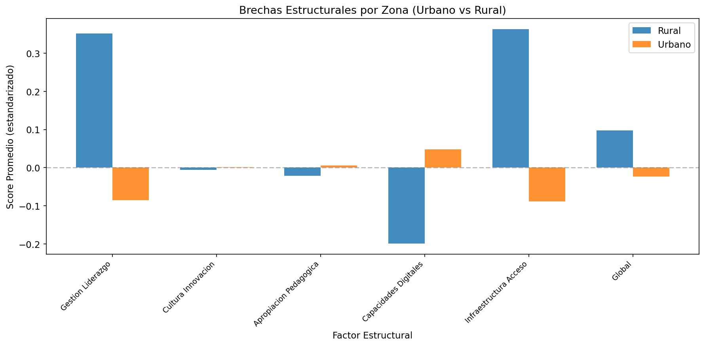

Grafico de barras agrupadas que compara el score promedio estandarizado de cada factor estructural entre zonas urbana y rural. Las diferencias visibles en Gestion y Liderazgo e Infraestructura y Acceso contrastan con la similitud en Cultura de Innovacion y Apropiacion Pedagogica.

#### 8.2 Distribucion de scores por zona (boxplot)

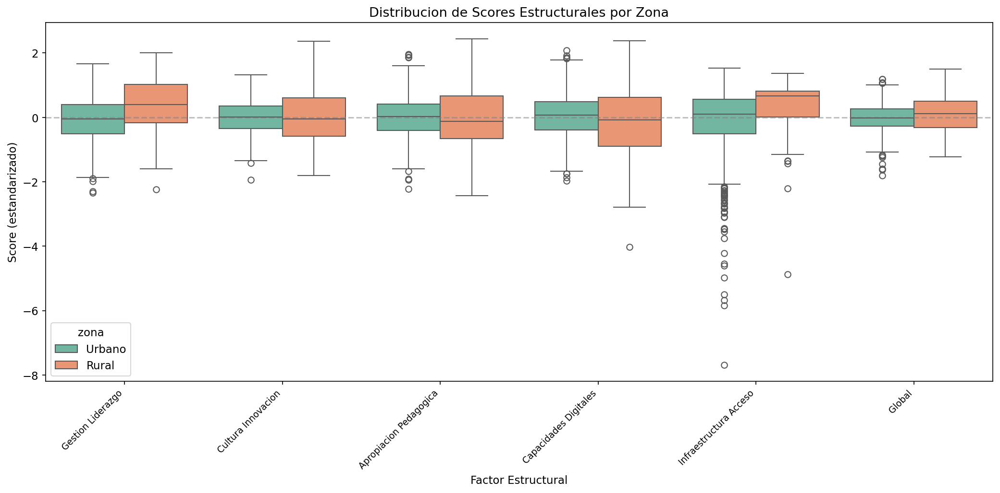

Los boxplots revelan no solo las diferencias de medias sino la **dispersion interna** de cada grupo. La zona rural presenta mayor variabilidad en todos los factores (cajas mas amplias), lo que indica mayor heterogeneidad entre establecimientos rurales. Esto sugiere que la ruralidad no es un predictor homogeneo del nivel de digitalizacion.

#### 8.3 Perfil de factores por zona

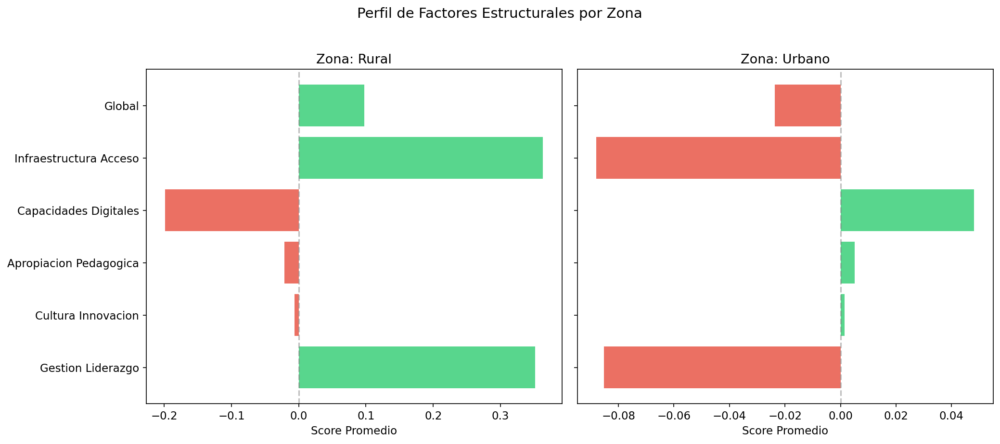

Barras horizontales que muestran el perfil completo de cada zona. El color verde indica scores por encima del promedio; el rojo, por debajo. Este grafico permite identificar rapidamente las fortalezas y debilidades relativas de cada territorio.

#### 8.4 Desalineacion interna entre factores

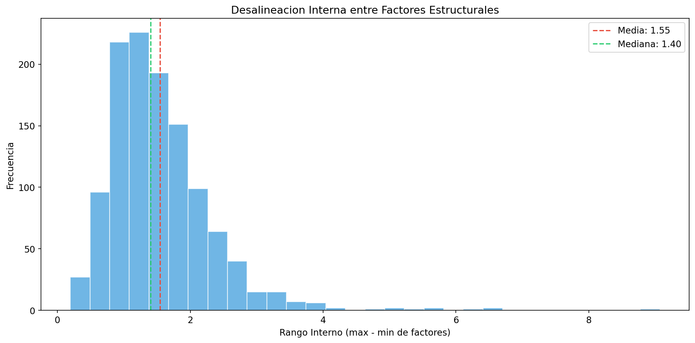

Histograma del rango interno (diferencia entre el factor mas alto y el mas bajo) por establecimiento. La media de 1,55 y la mediana similar indican que la mayoria de los establecimientos tiene al menos un factor significativamente rezagado respecto a otro. Esta desalineacion es una problematica critica del sistema.

---

## 9. PASO 5 — Segmentacion de Establecimientos

### Script: `src/clustering/segment_schools.py`

**Que se hizo.** Se aplico KMeans sobre los 5 scores estructurales de los 1.169 establecimientos con datos completos. Se evaluo el numero optimo de clusters (k) entre 2 y 8 mediante:

- **Metodo del codo** (inercia / WCSS)
- **Coeficiente de silueta** (calidad de la separacion)

El k optimo fue **k = 3** con un coeficiente de silueta de **0,2182**, lo cual indica clusters con superposicion parcial, coherente con la naturaleza continua de los datos educacionales.

Se asignaron tipologias descriptivas basadas en el ranking relativo de scores promedio por cluster.

### Perfiles de las 3 tipologias

| Tipologia | N | % | Gest. y Lid. | Cult. Innov. | Aprop. Pedag. | Cap. Digit. | Infra. y Acceso |
|-----------|--:|--:|------------:|------------:|-------------:|-----------:|----------------:|
| **Avanzado** | 490 | 41,9% | +0,39 | +0,32 | +0,43 | +0,48 | +0,34 |
| **Emergente** | 498 | 42,6% | -0,31 | -0,31 | -0,37 | -0,50 | +0,30 |
| **Rezagado** | 181 | 15,5% | -0,20 | -0,03 | -0,14 | +0,07 | **-1,75** |

> **Interpretacion:**
>
> - **Avanzado (41,9%):** Establecimientos con scores positivos en todos los factores. Representan el segmento mas integrado del sistema.
>
> - **Emergente (42,6%):** Scores negativos en gestion, cultura, apropiacion y capacidades, pero **positivo en infraestructura**. Este es un patron revelador: tienen equipamiento pero no lo capitalizan. Representan la desconexion entre disponibilidad tecnologica y uso pedagogico.
>
> - **Rezagado (15,5%):** Score extremadamente bajo en infraestructura (-1,75) pero cercano al promedio en otros factores. Son establecimientos con voluntad pero sin recursos. Requieren intervencion prioritaria en equipamiento y conectividad.

### Composicion territorial

| Tipologia | % Rural | % Urbano |
|-----------|--------:|---------:|
| Avanzado | 22,9% | 77,1% |
| Emergente | 21,9% | 78,1% |
| Rezagado | 3,9% | 96,1% |

> **Hallazgo:** Contraintuitivamente, el cluster Rezagado es **predominantemente urbano** (96,1%). Esto indica que la precariedad de infraestructura no es exclusiva del mundo rural; existe un segmento urbano significativo con severo deficit de acceso tecnologico.

**Tablas de salida:**
- `outputs/tables/clustering_establecimientos.csv`
- `outputs/tables/perfiles_clusters.csv`

### Graficos generados

#### 9.1 Seleccion del numero optimo de clusters

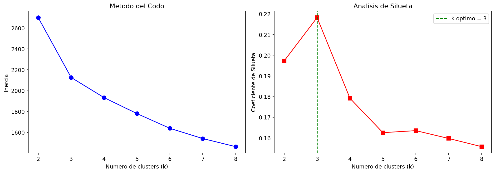

Panel dual que muestra la inercia (metodo del codo) y el coeficiente de silueta para cada valor de k evaluado. El k = 3 presenta el mejor equilibrio entre parsimonia y calidad de separacion.

#### 9.2 Heatmap de perfiles por cluster

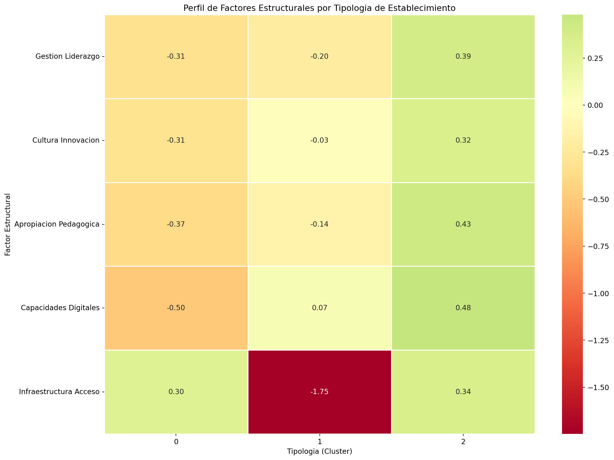

Mapa de calor que muestra el score promedio de cada factor por tipologia. Permite visualizar de un vistazo el perfil diferenciado de cada segmento: el contraste entre infraestructura alta y capacidades bajas en el cluster Emergente es particularmente visible.

#### 9.3 Proyeccion PCA de clusters

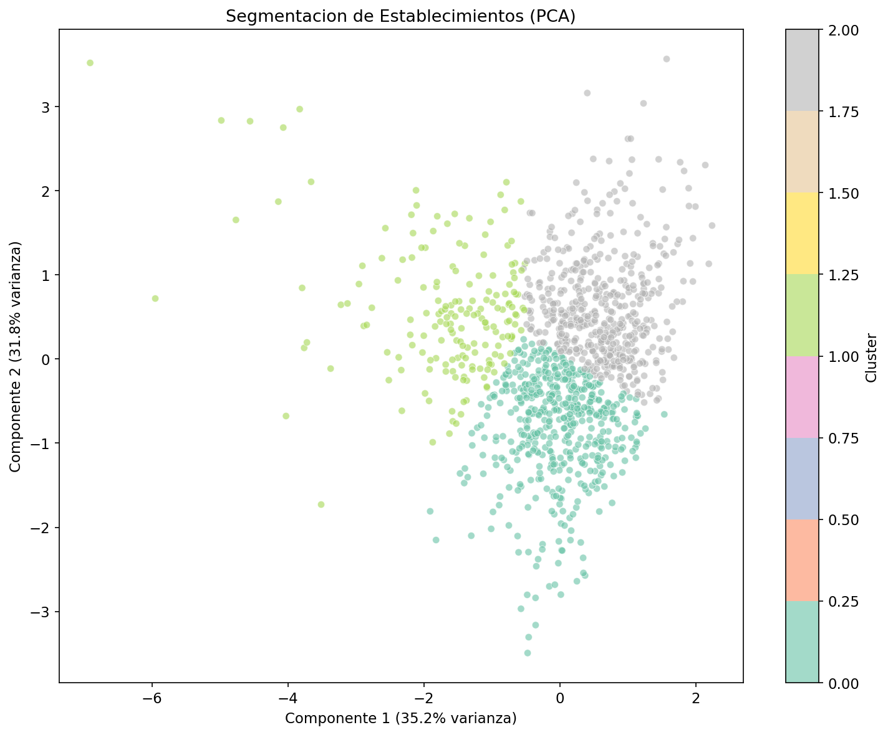

Proyeccion bidimensional (PCA) de los establecimientos coloreados por cluster. La superposicion parcial entre clusters es esperada (silueta = 0,22) y refleja que las tipologias son tendencias, no categorias discretas.

#### 9.4 Composicion de clusters por zona

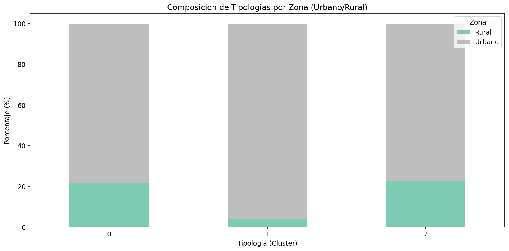

Grafico de barras apiladas que muestra la proporcion urbano/rural dentro de cada tipologia. El dato mas relevante es la baja presencia rural en el cluster Rezagado, desafiando la asuncion de que el deficit de infraestructura es un problema exclusivamente rural.

---

## 10. PASO 6 — Correlaciones y Cuellos de Botella

### Script: `src/correlations/bottlenecks.py`

**Que se hizo.** Se calculo la **matriz de correlaciones Spearman** entre los 5 factores estructurales y el score global. Spearman fue elegido por ser robusto a relaciones no lineales y datos ordinales. Se identificaron cuellos de botella combinando el nivel del factor (media) con su conectividad (correlacion media absoluta con otros factores).

### Matriz de correlaciones Spearman

| | Gest. Lid. | Cult. Inn. | Aprop. Ped. | Cap. Dig. | Infra. Acc. |
|---|---:|---:|---:|---:|---:|
| **Gest. Liderazgo** | 1,00 | 0,29 | 0,33 | 0,16 | 0,08 |
| **Cult. Innovacion** | 0,29 | 1,00 | 0,27 | 0,33 | 0,00 |
| **Aprop. Pedagogica** | 0,33 | 0,27 | 1,00 | 0,38 | 0,08 |
| **Cap. Digitales** | 0,16 | 0,33 | 0,38 | 1,00 | -0,05 |
| **Infra. y Acceso** | 0,08 | 0,00 | 0,08 | -0,05 | 1,00 |

> **Interpretacion:**
>
> - **Apropiacion Pedagogica y Capacidades Digitales** presentan la correlacion mas alta (0,38), lo que indica que el desarrollo de habilidades digitales y su uso pedagogico avanzan juntos. Mejorar uno sin el otro tiene efecto limitado.
>
> - **Gestion y Liderazgo se correlaciona con Apropiacion Pedagogica** (0,33), confirmando que el liderazgo directivo es un habilitador de la integracion curricular de tecnologias.
>
> - **Infraestructura y Acceso esta practicamente desconectada** de los demas factores (correlaciones cercanas a 0 o negativas). Esto es un hallazgo critico: **tener equipos no implica usarlos bien, y usarlos bien no requiere necesariamente mas equipos**. La infraestructura es condicion necesaria pero no suficiente, y su mejora aislada no se traduce en mejoras en otros factores.

### Analisis de cuellos de botella

| Factor | Media | Corr. media abs. | Relaciones fuertes (>0,30) | Severidad |
|--------|------:|------------------:|---------------------------:|----------:|
| Apropiacion Pedagogica | 0,00 | 0,34 | Gestion Lid., Cap. Dig., Global | ~0 |
| Capacidades Digitales | 0,00 | 0,30 | Cult. Inn., Aprop. Ped., Global | ~0 |
| Cultura Innovacion | 0,00 | 0,29 | Cap. Dig., Global | ~0 |
| Gestion Liderazgo | 0,00 | 0,29 | Aprop. Ped., Global | ~0 |
| Infraestructura y Acceso | 0,00 | 0,13 | Global | ~0 |

> **Interpretacion:** Al estar todos los factores centrados en media ~0 (efecto de la normalizacion), la severidad como cuello de botella es baja a nivel agregado. Sin embargo, la **alta conectividad de Apropiacion Pedagogica** (3 relaciones fuertes, correlacion media de 0,34) la convierte en el **factor mas estrategico**: mejoras en apropiacion pedagogica tienen el mayor potencial de irradiar hacia otros factores. Por contraste, mejoras en infraestructura (correlacion media 0,13, solo 1 relacion fuerte) tienen bajo potencial de cascada.

**Tablas de salida:**
- `outputs/tables/matriz_correlaciones_spearman.csv`
- `outputs/tables/cuellos_botella_estructurales.csv`

### Graficos generados

#### 10.1 Heatmap de correlaciones Spearman

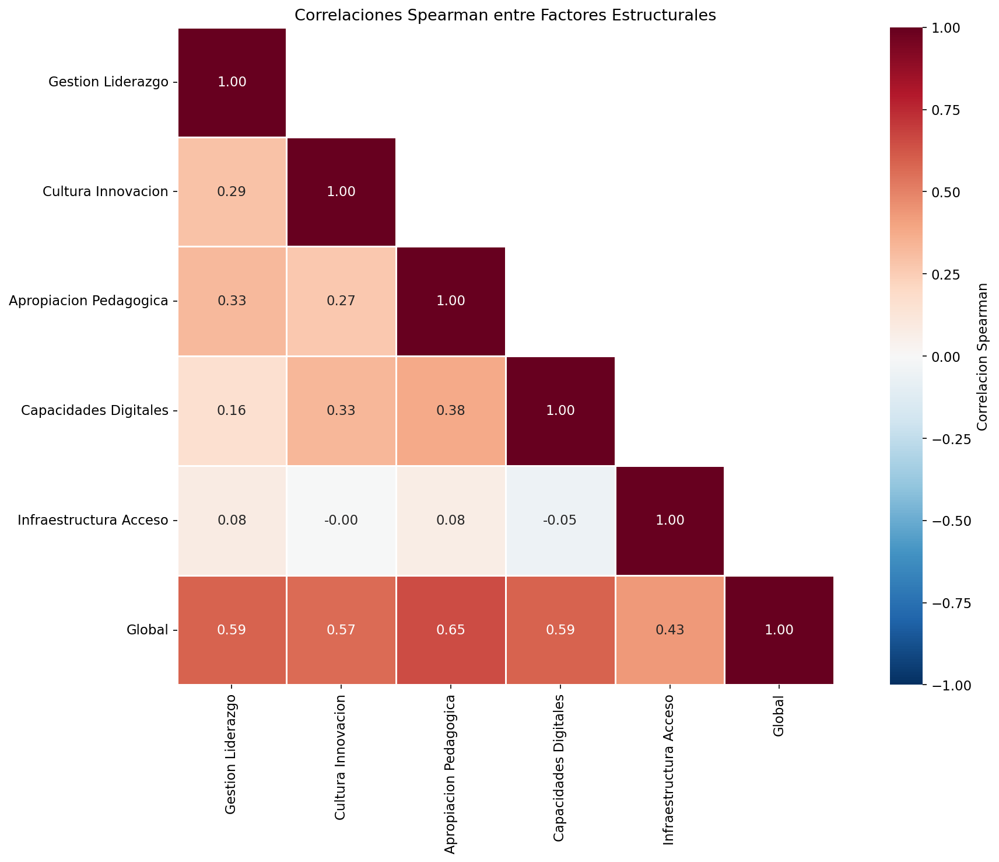

Matriz triangular inferior con anotaciones numericas. Los tonos rojos (positivos) y azules (negativos) permiten identificar rapidamente las relaciones. El aislamiento de Infraestructura y Acceso (fila/columna casi blanca) es visualmente evidente.

#### 10.2 Cuellos de botella estructurales

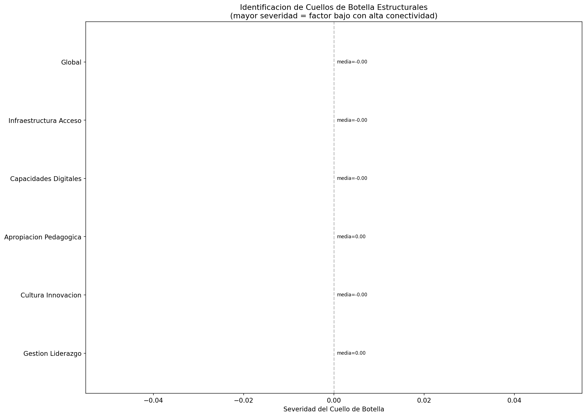

Grafico de barras horizontales que ordena los factores segun su severidad como cuello de botella. A nivel agregado las severidades son similares, pero la estructura de conectividad revela que Apropiacion Pedagogica es el factor mas estrategico.

#### 10.3 Correlaciones por zona

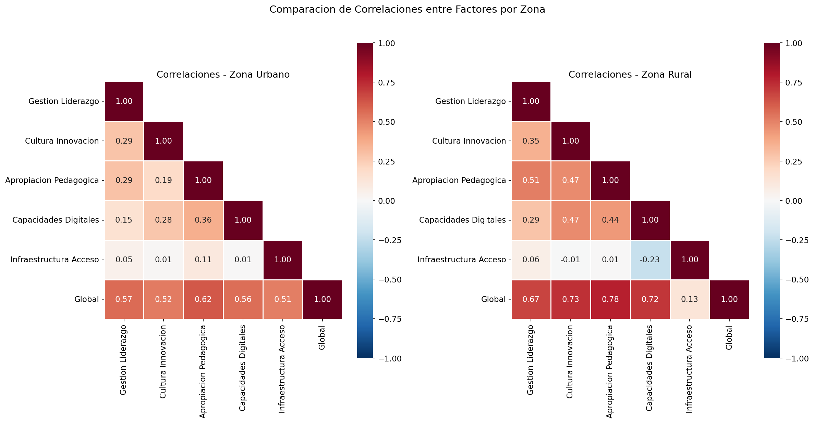

Comparacion lado a lado de las matrices de correlacion para zonas urbana y rural. Las diferencias en patrones de correlacion entre zonas sugieren que los mecanismos de la digitalizacion operan de forma diferente segun el contexto territorial.

---

## 11. PASO 7 — Sintesis de Problematicas Estructurales

### Script: `src/synthesis/structural_pain_points.py`

**Que se hizo.** Se integraron todos los hallazgos anteriores (brechas, clustering, correlaciones, desalineaciones) en un listado priorizado de 5 problematicas estructurales, cada una con: titulo, tipo, descripcion, evidencia empirica, factores involucrados, magnitud y nivel de analisis.

La priorizacion se basa en la magnitud del efecto:
- **CRITICA:** magnitud >= 0,80
- **ALTA:** magnitud >= 0,50
- **MEDIA:** magnitud >= 0,30
- **BAJA:** magnitud < 0,30

---

### PROBLEMATICA 1 — PRIORIDAD CRITICA

**Desarrollo desigual de capacidades digitales dentro de los establecimientos**

| Atributo | Valor |
|----------|-------|
| Tipo | Desalineacion interna |
| Nivel de analisis | Establecimientos |
| Magnitud | 1,55 (d.e.) |

**Descripcion.** El 25% de los establecimientos con mayor desalineacion interna presenta un rango entre factores superior a 1,89 desviaciones estandar. El rango medio del sistema es de 1,55. Esto indica que la digitalizacion avanza de forma **fragmentaria**: algunos factores progresan mientras otros se estancan, generando una digitalizacion incompleta y potencialmente ineficaz.

**Evidencia.** Rango medio entre factores: 1,55; percentil 75: 1,89. Distribucion visible en el histograma de desalineacion interna.

**Implicancia para politica publica.** Las intervenciones unidimensionales (solo equipos, solo capacitacion, solo gestion) no resuelven el problema. Se requieren estrategias **integrales** que aborden multiples factores simultaneamente en cada establecimiento, calibradas segun su perfil especifico de desalineacion.

---

### PROBLEMATICA 2 — PRIORIDAD CRITICA

**Desalineacion entre capacidades y apropiacion pedagogica a nivel de sistema**

| Atributo | Valor |
|----------|-------|
| Tipo | Desalineacion interna |
| Nivel de analisis | Sistema educativo |
| Magnitud | 1,55 (d.e.) |

**Descripcion.** A nivel de sistema, se observa una desalineacion entre Apropiacion Pedagogica y Capacidades Digitales. Aunque sus medias son similares (ambas ~0), la variabilidad entre establecimientos es alta. La digitalizacion no avanza de forma homogenea en todas sus dimensiones.

**Evidencia.** Rango interno medio del sistema: 1,55 desviaciones estandar.

**Implicancia para politica publica.** El sistema requiere mecanismos que alineen el desarrollo de habilidades digitales con su aplicacion pedagogica efectiva. La formacion docente debe integrar competencias tecnicas y didacticas de forma simultanea, no secuencial.

---

### PROBLEMATICA 3 — PRIORIDAD ALTA

**Brecha urbano-rural en digitalizacion escolar**

| Atributo | Valor |
|----------|-------|
| Tipo | Brecha territorial |
| Nivel de analisis | Territorial |
| Magnitud | 0,61 (d de Cohen) |

**Descripcion.** Existe una diferencia significativa entre establecimientos urbanos y rurales en el factor Gestion y Liderazgo (d = 0,61). Los establecimientos rurales presentan un score mas alto (+0,35 vs. -0,09), lo que podria reflejar dinamicas de gestion diferentes en contextos de menor escala.

**Evidencia.** 1 brecha significativa detectada (magnitud > 0,50). La zona rural tambien muestra mayor variabilidad en todos los factores (visible en boxplots).

**Implicancia para politica publica.** La brecha urbano-rural no es unidireccional ni simple. Los establecimientos rurales presentan fortalezas en gestion pero debilidades en capacidades digitales. Las politicas focalizadas en ruralidad deben capitalizar las fortalezas de gestion existentes como palanca para mejorar las capacidades.

---

### PROBLEMATICA 4 — PRIORIDAD ALTA

**Inequidades segun tipo de administracion educativa**

| Atributo | Valor |
|----------|-------|
| Tipo | Brecha institucional |
| Nivel de analisis | Institucional |
| Magnitud | 0,60 (d de Cohen) |

**Descripcion.** La dependencia administrativa se asocia a diferencias significativas en 3 factores: Gestion y Liderazgo (d = 0,60), Capacidades Digitales (d = 0,56) e Infraestructura y Acceso (d = 0,53). Las mayores diferencias se observan entre establecimientos Municipales (cod. 1) y de Corporacion de Administracion Delegada (cod. 3).

**Evidencia.** 3 brechas significativas por dependencia administrativa. Los establecimientos municipales presentan mejor Gestion e Infraestructura, mientras que las corporaciones delegadas muestran mejores Capacidades Digitales.

**Implicancia para politica publica.** Las condiciones institucionales no son neutrales. Cada tipo de administracion genera un perfil diferente de digitalizacion. Las politicas no pueden ser genericas; deben considerar el marco institucional como una variable que condiciona la efectividad de las intervenciones.

---

### PROBLEMATICA 5 — PRIORIDAD BAJA

**Segmento significativo de establecimientos rezagados**

| Atributo | Valor |
|----------|-------|
| Tipo | Segmentacion |
| Nivel de analisis | Tipologias de establecimientos |
| Magnitud | 15,5% del sistema |

**Descripcion.** 181 establecimientos (15,5% del total) pertenecen a la tipologia "Rezagado", caracterizada por un deficit extremo de infraestructura (score = -1,75) pero niveles cercanos al promedio en otros factores. Son predominantemente urbanos (96,1%).

**Evidencia.** Cluster 1 del analisis KMeans. 181 establecimientos con score de infraestructura = -1,75 desviaciones estandar bajo el promedio.

**Implicancia para politica publica.** Este segmento requiere intervencion **prioritaria y focalizada en infraestructura**, pero no exclusivamente. La intervencion en equipamiento debe acompanarse de apoyo al uso para capitalizar las capacidades existentes en otros factores. Al ser predominantemente urbano, este segmento podria estar invisible para politicas que asumen el deficit de infraestructura como un problema rural.

---

## 12. Inventario de Outputs — Analisis Estructural (Pasos 1-7)

### 12.1 Tablas analiticas (`outputs/tables/`)

| Archivo | Descripcion | Filas |
|---------|-------------|------:|
| `validacion_estructura_datos.csv` | Resumen de integridad por dataset | 7 |
| `mapa_indicadores_dimensiones.csv` | Mapeo de 68 indicadores a factores | 68 |
| `scores_factores_establecimiento.csv` | Score por factor para cada establecimiento | 1.174 |
| `resumen_scores_por_zona.csv` | Media, mediana y d.e. de scores por zona | 2 |
| `brechas_estructurales.csv` | 25 brechas detectadas con magnitud | 25 |
| `clustering_establecimientos.csv` | Asignacion de cluster por establecimiento | 1.174 |
| `perfiles_clusters.csv` | Perfil de scores por tipologia | 3 |
| `matriz_correlaciones_spearman.csv` | Correlaciones entre factores | 6x6 |
| `cuellos_botella_estructurales.csv` | Severidad de cada factor como cuello de botella | 6 |
| `dolores_estructurales_priorizados.csv` | 5 problematicas con prioridad y evidencia | 5 |

### 12.2 Figuras (`outputs/figures/`)

| Archivo | Paso | Descripcion |
|---------|------|-------------|
| `brechas_scores_por_zona.png` | 4 | Barras comparativas de scores por zona |
| `boxplot_scores_por_zona.png` | 4 | Distribucion de scores por zona |
| `perfil_factores_por_zona.png` | 4 | Perfil de fortalezas/debilidades por zona |
| `desalineacion_interna_factores.png` | 4 | Histograma de rango interno por establecimiento |
| `seleccion_k_clusters.png` | 5 | Metodo del codo y coeficiente de silueta |
| `heatmap_perfiles_clusters.png` | 5 | Mapa de calor de perfiles por tipologia |
| `pca_clusters_establecimientos.png` | 5 | Proyeccion PCA 2D de clusters |
| `composicion_clusters_zona.png` | 5 | Composicion territorial de cada tipologia |
| `heatmap_correlaciones_spearman.png` | 6 | Matriz de correlaciones entre factores |
| `cuellos_botella_estructurales.png` | 6 | Ranking de severidad como cuello de botella |
| `correlaciones_por_zona.png` | 6 | Comparacion de correlaciones urbano vs. rural |

### 12.3 Reportes (`outputs/reports/`)

| Archivo | Descripcion |
|---------|-------------|
| `reporte_sintesis_problematicas.txt` | Listado priorizado con conclusion general |

---

## 13. Etapa ML — Identificacion de Oportunidades de Software Educativo

### 13.1 Objetivo y Metodologia

Esta etapa extiende el analisis estructural de la ENDDEIE 2023 hacia la **identificacion empirica de oportunidades de desarrollo de software educativo**. Mientras los pasos 1-7 caracterizan las problematicas de la digitalizacion escolar, los pasos 8-11 traducen esos patrones en perfiles de necesidad de producto digital, drivers de adopcion y validaciones de robustez.

La metodologia integra cuatro tecnicas complementarias:

| Paso | Modulo | Tecnica | Objetivo |
|------|--------|---------|----------|
| 8 | `src/ml/dimensionality/latent_axes.py` | PCA + UMAP | Identificar ejes latentes de necesidad digital |
| 9 | `src/ml/clustering/software_needs_profiles.py` | KMeans dual (scores + desalineacion) | Construir perfiles de necesidad de software |
| 10 | `src/ml/explainability/drivers_and_barriers.py` | Random Forest + Arbol de Decision | Detectar drivers y barreras para la adopcion digital |
| 11 | `src/ml/evaluation/stability_checks.py` | Bootstrap (100 iteraciones) | Evaluar estabilidad de clusters y ejes |

### Arquitectura de la extension ML

```
src/ml/
  ├── dimensionality/
  │   └── latent_axes.py              → PCA factores, PCA dimensiones, UMAP
  ├── clustering/
  │   └── software_needs_profiles.py  → Clustering dual, perfilamiento de producto
  ├── explainability/
  │   └── drivers_and_barriers.py     → RF importancias, arbol de reglas, drivers/barreras
  └── evaluation/
      └── stability_checks.py         → Bootstrap clusters, bootstrap PCA
```

Cada modulo carga exclusivamente los outputs ya generados por el pipeline base (ej: `scores_factores_establecimiento.csv`) y no recalcula factores ni brechas.

---

### 13.2 PASO 8 — Reduccion Dimensional: Ejes Latentes de Necesidad Digital

#### Script: `src/ml/dimensionality/latent_axes.py`

**Que se hizo.** Se aplicaron dos tecnicas de reduccion dimensional complementarias:

1. **PCA sobre los 5 factores estructurales** para identificar ejes latentes a nivel agregado.
2. **PCA sobre las 12 dimensiones compuestas** originales para mayor granularidad analitica.
3. **UMAP** para una proyeccion 2D no lineal que captura estructuras manifold no detectadas por PCA.

**Por que se hizo.** Los 5 factores estructurales, si bien interpretables, pueden ocultar ejes de necesidad transversales. PCA permite identificar combinaciones lineales de factores que concentran la mayor variabilidad del sistema, mientras que UMAP revela agrupaciones no lineales.

#### Varianza explicada (PCA sobre factores)

| Componente | Varianza Explicada | Acumulada | Interpretacion |
|------------|-------------------:|----------:|----------------|
| Eje 1 | 35,2% | 35,2% | Eje de infraestructura vs. capacidades (carga dominante: Infraestructura 0,91) |
| Eje 2 | 31,8% | 67,0% | Eje de madurez pedagogica-digital (cargas: Capacidades 0,60, Apropiacion 0,47) |
| Eje 3 | 15,2% | 82,2% | Eje de gestion institucional (carga: Gestion 0,76) |
| Eje 4 | 9,6% | 91,8% | Eje de apropiacion pedagogica vs. cultura (carga: Apropiacion 0,79) |
| Eje 5 | 8,1% | 100% | Eje de cultura de innovacion (carga: Cultura 0,74) |

> **Hallazgo clave.** El primer eje latente (35,2% de la varianza) esta dominado por Infraestructura y Acceso (carga 0,91), confirmando que esta dimension es el principal diferenciador entre establecimientos. El segundo eje captura la madurez pedagogica-digital, lo que sugiere que **dos tipos de software responden a las dos principales fuentes de variabilidad del sistema**: soluciones de infraestructura/conectividad y plataformas de desarrollo de competencias docentes.

#### Varianza explicada (PCA sobre 12 dimensiones)

Los primeros 5 ejes explican el 62,8% de la varianza total. La interpretacion automatica basada en cargas sugiere tres tipos de necesidad de software:

| Eje | Varianza | Tipo de necesidad sugerida |
|-----|----------|---------------------------|
| Eje 1 | 22,2% | Plataforma de desarrollo de competencias docentes |
| Eje 2 | 14,9% | Software de gestion escolar y liderazgo digital |
| Eje 3 | 8,8% | Plataforma de desarrollo de competencias docentes |
| Eje 4 | 8,7% | Software de gestion escolar y liderazgo digital |
| Eje 5 | 8,2% | Software de gestion pedagogica integrada |

**Tablas de salida:**
- `outputs/tables/ml_cargas_pca_factores.csv`
- `outputs/tables/ml_cargas_pca_dimensiones.csv`
- `outputs/tables/ml_interpretacion_ejes_latentes.csv`
- `outputs/tables/ml_proyecciones_establecimientos.csv`

#### Graficos generados

| Archivo | Descripcion |
|---------|-------------|
| `ml_varianza_explicada_pca.png` | Panel dual: varianza PCA sobre factores (5 vars) y dimensiones (12 vars) |
| `ml_proyeccion_pca_2d.png` | Scatter 2D PCA coloreado por zona y tipologia |
| `ml_proyeccion_umap_2d.png` | Scatter 2D UMAP coloreado por zona y tipologia |
| `ml_cargas_pca_ejes_dimensiones.png` | Heatmap de cargas por eje latente (12 dimensiones) |
| `ml_cargas_pca_ejes_factores.png` | Heatmap de cargas por eje latente (5 factores) |

---

### 13.3 PASO 9 — Perfiles de Necesidad de Software Educativo

#### Script: `src/ml/clustering/software_needs_profiles.py`

**Que se hizo.** Se ejecutaron dos enfoques de clustering KMeans en paralelo:

1. **Clustering por scores directos**: segmenta establecimientos segun su nivel absoluto en cada factor.
2. **Clustering por desalineacion interna**: segmenta establecimientos segun sus patrones de desequilibrio entre factores (rango, diferencias entre pares estrategicos).

Se evaluo el rango k=[2,7] para cada enfoque, seleccionando el k con mayor coeficiente de silueta. Los perfiles resultantes fueron traducidos automaticamente a lenguaje de producto.

**Comparacion de enfoques:**

| Enfoque | k optimo | Silueta |
|---------|:--------:|:-------:|
| Scores directos | 3 | 0,2182 |
| Desalineacion interna | 3 | 0,1888 |

El enfoque por scores directos fue seleccionado como principal por presentar mayor separacion entre clusters.

#### Perfiles de necesidad identificados

| Perfil | N | % Sistema | Tipo | Solucion Sugerida |
|--------|--:|:---------:|------|-------------------|
| **Perfil mixto (fortaleza: Infraestructura)** | 498 | 42,6% | Transversal | Solucion adaptativa segun diagnostico institucional |
| **Digitalmente maduro** | 490 | 41,9% | Administrativo | Plataforma avanzada de analitica e innovacion educativa |
| **Deficit critico de infraestructura** | 181 | 15,5% | Transversal | Solucion offline-first con sincronizacion diferida |

> **Interpretacion para desarrollo de producto:**
>
> - **Perfil mixto (42,6%):** Establecimientos con infraestructura superior al promedio pero scores negativos en gestion, cultura, apropiacion y capacidades. Necesitan una solucion adaptativa que diagnostique sus brechas especificas y proporcione modulos de intervencion diferenciados. El mercado potencial es el mayor del sistema.
>
> - **Digitalmente maduro (41,9%):** Establecimientos con scores positivos en todos los factores. Su necesidad principal no es remedial sino de profundizacion: analitica educativa avanzada, dashboard de indicadores, herramientas de innovacion colaborativa.
>
> - **Deficit critico de infraestructura (15,5%):** Establecimientos con score de infraestructura extremadamente bajo (-1,75 d.e.) pero niveles cercanos al promedio en otros factores. Requieren soluciones que funcionen con conectividad limitada o intermitente (offline-first), con sincronizacion diferida cuando haya conexion disponible.

**Tablas de salida:**
- `outputs/tables/ml_perfiles_necesidad_software.csv`
- `outputs/tables/ml_asignacion_perfiles_software.csv`
- `outputs/tables/ml_comparacion_enfoques_clustering.csv`

#### Graficos generados

| Archivo | Descripcion |
|---------|-------------|
| `ml_perfiles_necesidad_software.png` | Heatmap de perfiles con tipo de software anotado |
| `ml_comparacion_clustering_enfoques.png` | Comparacion side-by-side de ambos enfoques de clustering |
| `ml_radar_perfiles_necesidad.png` | Radar chart por perfil de necesidad |

---

### 13.4 PASO 10 — Explicabilidad: Drivers y Barreras para la Adopcion Digital

#### Script: `src/ml/explainability/drivers_and_barriers.py`

**Que se hizo.** Se entrenaron dos modelos explicativos sobre las 12 dimensiones compuestas, la desalineacion interna y variables de contexto (zona, dependencia), con el objetivo de explicar la pertenencia a los perfiles de necesidad de software:

1. **Random Forest (200 arboles, max_depth=6):** para obtener importancia de variables por indice Gini.
2. **Arbol de Decision (max_depth=4):** para extraer reglas interpretables de clasificacion.

**Metricas informativas (no es el objetivo principal):**

| Modelo | Accuracy CV (5-fold) |
|--------|:--------------------:|
| Random Forest | 0,887 +/- 0,020 |
| Arbol de Decision | 0,778 +/- 0,032 |

> La accuracy del RF (88,7%) indica que las dimensiones compuestas de la ENDDEIE discriminan fuertemente entre perfiles de necesidad, lo cual valida la coherencia de la segmentacion.

#### Ranking de importancia de variables (Top 10)

| # | Variable | Importancia (%) |
|:-:|----------|:--------------:|
| 1 | Acceso (inverso) | 43,3% |
| 2 | Efectos | 9,7% |
| 3 | Desalineacion Interna | 8,6% |
| 4 | Habilidades | 7,3% |
| 5 | Actividades | 6,8% |
| 6 | Innov. Ensenanza-Aprendizaje | 4,5% |
| 7 | Liderazgo Escolar | 3,9% |
| 8 | Marco Institucional | 3,5% |
| 9 | Promotores/Barreras | 3,0% |
| 10 | Actitudes | 3,0% |

> **Hallazgo clave.** La variable Acceso (inverso) concentra el 43,3% de la importancia, lo que confirma que la infraestructura es el principal discriminador entre perfiles de necesidad de software. Sin embargo, las siguientes cuatro variables (Efectos, Desalineacion, Habilidades, Actividades) acumulan un 32,5% adicional y son de naturaleza pedagogica-digital, indicando que las intervenciones de software mas efectivas deben abordar ambos ejes.

#### Clasificacion de Drivers y Barreras

| Variable | Rol | Importancia | Interpretacion |
|----------|-----|:-----------:|----------------|
| Marco Institucional | DRIVER | 3,5% | Valores altos facilitan la madurez digital |
| Liderazgo Escolar | DRIVER | 3,9% | Valores altos facilitan la madurez digital |
| Actividades | DRIVER | 6,8% | Valores altos facilitan la madurez digital |
| Apoyo al Uso | DRIVER | 1,8% | Valores altos facilitan la madurez digital |
| Innov. Ensenanza-Aprendizaje | DRIVER | 4,5% | Valores altos facilitan la madurez digital |
| Promotores/Barreras | DRIVER | 3,0% | Valores altos facilitan la madurez digital |
| Practicas de Innovacion | DRIVER | 2,2% | Valores altos facilitan la madurez digital |
| Efectos | DRIVER | 9,7% | Valores altos facilitan la madurez digital |
| Habilidades | DRIVER | 7,3% | Valores altos facilitan la madurez digital |
| Actitudes | DRIVER | 3,0% | Valores altos facilitan la madurez digital |
| Mentalidad Innovadora | DRIVER | 1,2% | Valores altos facilitan la madurez digital |
| Zona (Rural=1) | DRIVER | 1,0% | Valores altos facilitan la madurez digital |
| **Acceso (inverso)** | **BARRERA** | **43,3%** | **Variable en escala inversa: valores altos indican peor acceso** |
| Desalineacion Interna | BARRERA | 8,6% | Valores altos se asocian a menor madurez digital |
| Dependencia Adm. | BARRERA | 0,4% | Valores altos se asocian a menor madurez digital |

> **Interpretacion para desarrollo de producto:** Los 12 drivers identificados cubren todas las dimensiones del proceso educativo (liderazgo, innovacion, habilidades, actitudes). Esto implica que una solucion de software efectiva debe ser **multidimensional**: no basta un LMS o un sistema de gestion; se requiere una plataforma que integre gestion institucional, desarrollo profesional docente y apoyo a la innovacion pedagogica. Las dos barreras principales (deficit de acceso y desalineacion interna) deben ser abordadas como prerequisitos: sin infraestructura minima y sin alineacion entre capacidades, las herramientas digitales no seran adoptadas.

**Tablas de salida:**
- `outputs/tables/ml_importancia_variables_rf.csv`
- `outputs/tables/ml_drivers_barreras_adopcion.csv`
- `outputs/tables/ml_reglas_arbol_decision.csv`

#### Graficos generados

| Archivo | Descripcion |
|---------|-------------|
| `ml_importancia_variables_rf.png` | Ranking de importancia de variables (Random Forest) |
| `ml_drivers_vs_barreras.png` | Grafico divergente de drivers vs. barreras |
| `ml_arbol_decision_perfiles.png` | Arbol de decision visualizado con reglas |

---

### 13.5 PASO 11 — Evaluacion de Estabilidad

#### Script: `src/ml/evaluation/stability_checks.py`

**Que se hizo.** Se evaluo la robustez de los resultados mediante 100 iteraciones de bootstrap con subsampling al 80%:

1. **Estabilidad de clusters:** se reejecutaron los KMeans en cada muestra y se comparo con la solucion de referencia usando el Adjusted Rand Index (ARI).
2. **Estabilidad de PCA:** se recalculo el PCA en cada muestra y se evaluo la consistencia de la varianza explicada y las cargas del primer componente.

#### Resumen de estabilidad

| Analisis | Metrica | Media | Desv. Est. | Min | Max | Interpretacion |
|----------|---------|:-----:|:----------:|:---:|:---:|----------------|
| Clustering (KMeans) | ARI vs referencia | 0,9412 | 0,0386 | 0,8047 | 0,9923 | **Clusters altamente estables** |
| Clustering (KMeans) | Silueta bootstrap | 0,2190 | 0,0036 | 0,2071 | 0,2254 | Superposicion significativa, coherente con datos continuos |
| PCA (dimensiones) | Varianza PC1 | 0,2227 | 0,0048 | 0,2112 | 0,2336 | **Estructura dimensional estable** |
| PCA (dimensiones) | Correlacion cargas PC1 | 0,9909 | 0,0087 | 0,9359 | 0,9987 | **Ejes latentes muy estables** |

> **Interpretacion:** Los resultados son robustos. El ARI medio de 0,94 indica que la solucion de clustering se reproduce consistentemente en submuestras, lo que valida los perfiles de necesidad de software como estructuras reales del sistema (no artefactos del muestreo). La correlacion de cargas PCA de 0,99 confirma que los ejes latentes son estables y no dependen de la muestra especifica.

**Tablas de salida:**
- `outputs/tables/ml_estabilidad_clusters.csv`
- `outputs/tables/ml_estabilidad_pca.csv`
- `outputs/tables/ml_resumen_estabilidad.csv`

#### Graficos generados

| Archivo | Descripcion |
|---------|-------------|
| `ml_estabilidad_bootstrap.png` | Panel 2x2 con distribucion de ARI, silueta, varianza PC1 y correlacion de cargas |

---

### 13.6 Sintesis: Implicancias para Desarrollo de Productos Digitales

Los resultados de la etapa ML permiten responder tres preguntas clave para el desarrollo de software educativo en Chile:

#### Pregunta 1: Que tipo de software necesitan hoy las escuelas chilenas?

Se identifican **tres segmentos de demanda diferenciados**:

1. **Solucion adaptativa de diagnostico e intervencion diferenciada (42,6% del sistema):** Para establecimientos con infraestructura disponible pero brechas en capacidades, gestion y apropiacion. Requiere modulos configurables que se adapten al perfil especifico de cada escuela.

2. **Plataforma avanzada de analitica e innovacion educativa (41,9%):** Para establecimientos digitalmente maduros que necesitan profundizar su uso de tecnologia: dashboards de indicadores, analitica de aprendizaje, herramientas de colaboracion docente avanzada.

3. **Solucion offline-first con sincronizacion diferida (15,5%):** Para establecimientos con deficit critico de infraestructura. Debe funcionar sin conexion permanente, sincronizando datos cuando la conectividad este disponible.

#### Pregunta 2: Que perfiles concentran mayor demanda potencial?

El segmento de mayor volumen (42,6%) corresponde a establecimientos con **infraestructura disponible pero sin apropiacion efectiva**. Este es el mercado con mayor potencial de impacto y escalabilidad, dado que la barrera de acceso ya esta parcialmente resuelta. El segundo segmento (41,9%) representa demanda de productos de mayor sofisticacion.

#### Pregunta 3: Que factores estructurales deben abordarse para que una solucion digital sea adoptada y escalable?

El analisis de drivers y barreras revela que:

- **Barrera critica (43,3% de importancia):** El deficit de infraestructura y acceso es el principal bloqueador. Cualquier solucion que no contemple escenarios de baja conectividad perdera al 15,5% del mercado.
- **Barrera secundaria (8,6%):** La desalineacion interna entre factores indica que no basta con abordar un solo eje. Las soluciones monodimensionales (solo LMS, solo gestion, solo capacitacion) tendran baja adopcion.
- **Drivers clave:** Los factores pedagogicos (Efectos, Habilidades, Actividades) y de liderazgo institucional (Marco Institucional, Liderazgo Escolar) son los principales facilitadores. Una solucion de software que integre **acompanamiento pedagogico** con **herramientas de gestion para directivos** tiene el mayor potencial de adopcion sostenida.

---

## 14. Inventario Completo de Outputs

### 14.1 Tablas analiticas (`outputs/tables/`)

| Archivo | Paso | Descripcion | Filas |
|---------|:----:|-------------|------:|
| `validacion_estructura_datos.csv` | 1 | Resumen de integridad por dataset | 7 |
| `mapa_indicadores_dimensiones.csv` | 2 | Mapeo de 68 indicadores a factores | 68 |
| `scores_factores_establecimiento.csv` | 3 | Score por factor para cada establecimiento | 1.174 |
| `resumen_scores_por_zona.csv` | 3 | Media, mediana y d.e. de scores por zona | 2 |
| `brechas_estructurales.csv` | 4 | 25 brechas detectadas con magnitud | 25 |
| `clustering_establecimientos.csv` | 5 | Asignacion de cluster por establecimiento | 1.174 |
| `perfiles_clusters.csv` | 5 | Perfil de scores por tipologia | 3 |
| `matriz_correlaciones_spearman.csv` | 6 | Correlaciones entre factores | 6x6 |
| `cuellos_botella_estructurales.csv` | 6 | Severidad de cada factor como cuello de botella | 6 |
| `dolores_estructurales_priorizados.csv` | 7 | 5 problematicas con prioridad y evidencia | 5 |
| `ml_cargas_pca_factores.csv` | 8 | Cargas PCA sobre 5 factores estructurales | 5 |
| `ml_cargas_pca_dimensiones.csv` | 8 | Cargas PCA sobre 12 dimensiones compuestas | 12 |
| `ml_interpretacion_ejes_latentes.csv` | 8 | Interpretacion automatica de ejes PCA | 12 |
| `ml_proyecciones_establecimientos.csv` | 8 | Coordenadas PCA y UMAP por establecimiento | 1.169 |
| `ml_perfiles_necesidad_software.csv` | 9 | Perfiles de necesidad con tipo de software | 3 |
| `ml_asignacion_perfiles_software.csv` | 9 | Asignacion de perfil por establecimiento | 1.169 |
| `ml_comparacion_enfoques_clustering.csv` | 9 | Comparacion scores vs desalineacion | 2 |
| `ml_importancia_variables_rf.csv` | 10 | Importancia de variables (Random Forest) | 15 |
| `ml_drivers_barreras_adopcion.csv` | 10 | Drivers y barreras clasificados | 15 |
| `ml_reglas_arbol_decision.csv` | 10 | Reglas del arbol de decision | 1 |
| `ml_estabilidad_clusters.csv` | 11 | 100 iteraciones bootstrap de clusters | 100 |
| `ml_estabilidad_pca.csv` | 11 | 100 iteraciones bootstrap de PCA | 100 |
| `ml_resumen_estabilidad.csv` | 11 | Resumen consolidado de estabilidad | 4 |

### 14.2 Figuras (`outputs/figures/`)

| Archivo | Paso | Descripcion |
|---------|:----:|-------------|
| `brechas_scores_por_zona.png` | 4 | Barras comparativas de scores por zona |
| `boxplot_scores_por_zona.png` | 4 | Distribucion de scores por zona |
| `perfil_factores_por_zona.png` | 4 | Perfil de fortalezas/debilidades por zona |
| `desalineacion_interna_factores.png` | 4 | Histograma de rango interno por establecimiento |
| `seleccion_k_clusters.png` | 5 | Metodo del codo y coeficiente de silueta |
| `heatmap_perfiles_clusters.png` | 5 | Mapa de calor de perfiles por tipologia |
| `pca_clusters_establecimientos.png` | 5 | Proyeccion PCA 2D de clusters |
| `composicion_clusters_zona.png` | 5 | Composicion territorial de cada tipologia |
| `heatmap_correlaciones_spearman.png` | 6 | Matriz de correlaciones entre factores |
| `cuellos_botella_estructurales.png` | 6 | Ranking de severidad como cuello de botella |
| `correlaciones_por_zona.png` | 6 | Comparacion de correlaciones urbano vs. rural |
| `ml_varianza_explicada_pca.png` | 8 | Panel dual de varianza PCA (factores y dimensiones) |
| `ml_proyeccion_pca_2d.png` | 8 | Scatter 2D PCA por zona y tipologia |
| `ml_proyeccion_umap_2d.png` | 8 | Scatter 2D UMAP por zona y tipologia |
| `ml_cargas_pca_ejes_dimensiones.png` | 8 | Heatmap de cargas por eje (12 dimensiones) |
| `ml_cargas_pca_ejes_factores.png` | 8 | Heatmap de cargas por eje (5 factores) |
| `ml_perfiles_necesidad_software.png` | 9 | Heatmap de perfiles de necesidad de software |
| `ml_comparacion_clustering_enfoques.png` | 9 | Comparacion de enfoques de clustering |
| `ml_radar_perfiles_necesidad.png` | 9 | Radar chart de perfiles de necesidad |
| `ml_importancia_variables_rf.png` | 10 | Importancia de variables (Random Forest) |
| `ml_drivers_vs_barreras.png` | 10 | Grafico divergente de drivers vs. barreras |
| `ml_arbol_decision_perfiles.png` | 10 | Arbol de decision visualizado |
| `ml_estabilidad_bootstrap.png` | 11 | Panel 2x2 de metricas de estabilidad |

### 14.3 Reportes (`outputs/reports/`)

| Archivo | Descripcion |
|---------|-------------|
| `reporte_sintesis_problematicas.txt` | Listado priorizado con conclusion general |

---

## 15. Librerias Utilizadas

```python
import pandas as pd              # Manipulacion de datos tabulares
import numpy as np                # Operaciones numericas
from sklearn.preprocessing import StandardScaler   # Normalizacion
from sklearn.decomposition import PCA              # Reduccion dimensional
from sklearn.cluster import KMeans                 # Segmentacion
from sklearn.metrics import silhouette_score        # Evaluacion de clusters
from sklearn.metrics import adjusted_rand_score     # Estabilidad de clusters
from sklearn.ensemble import RandomForestClassifier # Importancia de variables
from sklearn.tree import DecisionTreeClassifier     # Reglas interpretables
from sklearn.model_selection import cross_val_score # Validacion cruzada
import scipy.stats as stats       # Correlaciones Spearman
import umap                       # Proyeccion no lineal UMAP
import seaborn as sns             # Visualizacion estadistica
import matplotlib.pyplot as plt   # Graficos
```

---

## 16. Ejecucion

```bash
cd /home/pc01/Proyectos/ENDDEIE
python main.py
```

El pipeline completo (pasos 1-11) se ejecuta en un unico comando y genera todos los outputs automaticamente.

### Resultados cuantitativos del pipeline completo

| Metrica | Valor |
|---------|-------|
| Establecimientos analizados | 1.174 |
| Docentes incorporados | 3.736 |
| Estudiantes incorporados | 10.326 |
| Factores estructurales construidos | 5 |
| Brechas detectadas | 25 (5 significativas) |
| Tipologias de establecimientos | 3 |
| Problematicas estructurales identificadas | 5 |
| Perfiles de necesidad de software | 3 |
| Drivers de adopcion identificados | 12 |
| Barreras de adopcion identificadas | 3 |
| Tablas CSV generadas | 23 |
| Figuras PNG generadas | 23 |
| Reportes textuales | 1 |

---

## 17. Conclusion General

El analisis estructural de la ENDDEIE 2023 permite concluir, con evidencia empirica:

1. **La desalineacion interna es la problematica mas critica.** Los establecimientos no tienen un nivel homogeneo de digitalizacion: algunos factores avanzan mientras otros se estancan (rango medio de 1,55 d.e.). Esto genera una digitalizacion fragmentaria e ineficaz.

2. **La infraestructura esta desconectada del resto del sistema.** Las correlaciones entre Infraestructura y Acceso y los demas factores son cercanas a 0. Proveer equipos sin abordar gestion, cultura y apropiacion no genera mejoras.

3. **La brecha urbano-rural es real pero no simple.** Los establecimientos rurales muestran fortalezas en gestion pero debilidades en capacidades digitales. Ademas, el cluster mas rezagado en infraestructura es 96% urbano.

4. **El tipo de administracion condiciona el perfil de digitalizacion.** Las diferencias entre Municipal y Corporacion Delegada son significativas en 3 factores, sugiriendo que las condiciones institucionales no son neutrales.

5. **La apropiacion pedagogica es el factor mas estrategico.** Con la mayor conectividad (correlacion media de 0,34 y 3 relaciones fuertes), mejoras en apropiacion pedagogica tienen el mayor potencial de impacto cascada hacia otros factores.

6. **Existen tres perfiles diferenciados de necesidad de software.** El 42,6% del sistema necesita soluciones adaptativas de diagnostico e intervencion; el 41,9% requiere plataformas avanzadas de analitica; y el 15,5% necesita soluciones offline-first por deficit critico de infraestructura.

7. **Los resultados son robustos.** La evaluacion de estabilidad (ARI=0,94; correlacion de cargas PCA=0,99) confirma que los perfiles y ejes identificados son estructuras reales del sistema, no artefactos estadisticos.

> **Tesis de cierre.** Las principales problematicas de la digitalizacion educativa en Chile no responden a deficits aislados, sino a **desalineaciones estructurales entre capacidades, gestion y apropiacion pedagogica**, que afectan de forma diferenciada a distintos tipos de establecimientos y territorios. El analisis ML confirma que las oportunidades de software educativo deben ser **diferenciadas por perfil de necesidad**, **multidimensionales** (no monodimensionales) y **robustas frente a escenarios de baja conectividad**. Las soluciones con mayor potencial de adopcion son aquellas que integran acompanamiento pedagogico con herramientas de gestion institucional, abordando simultaneamente los drivers de madurez digital y las barreras de acceso e infraestructura.
